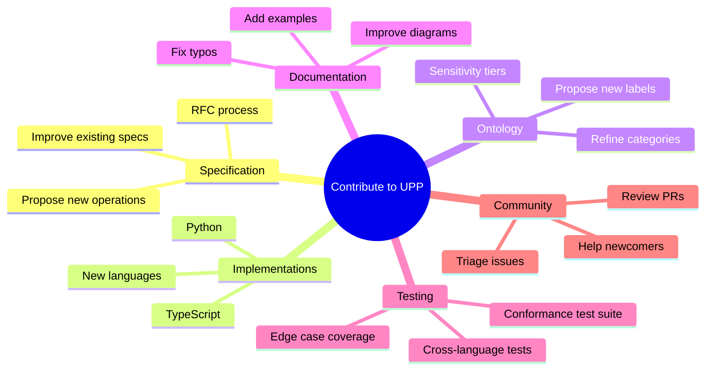
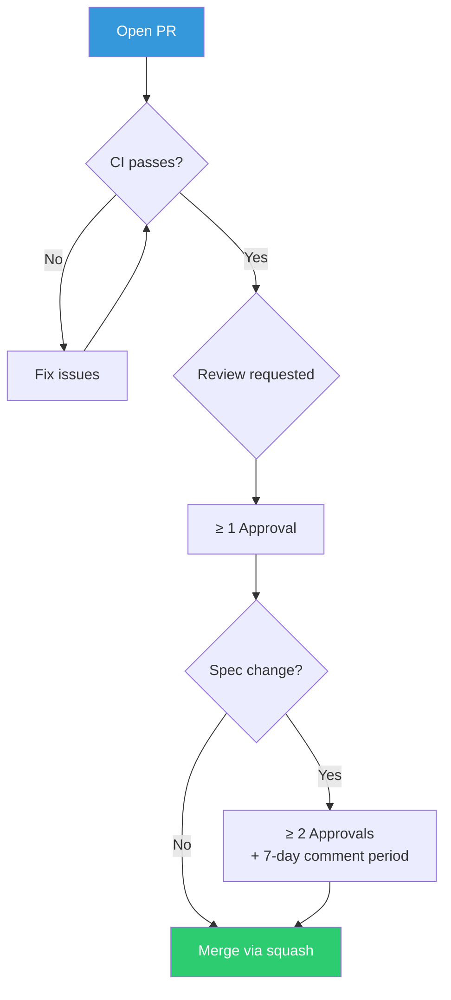
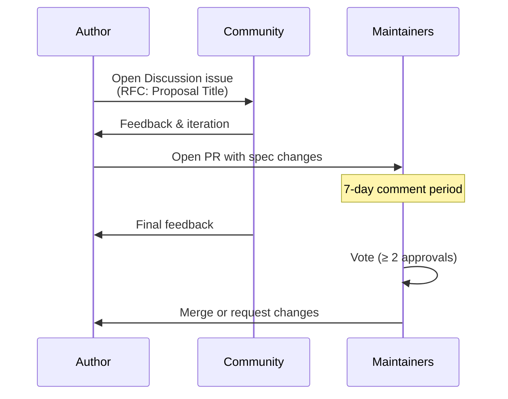
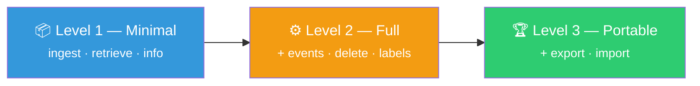
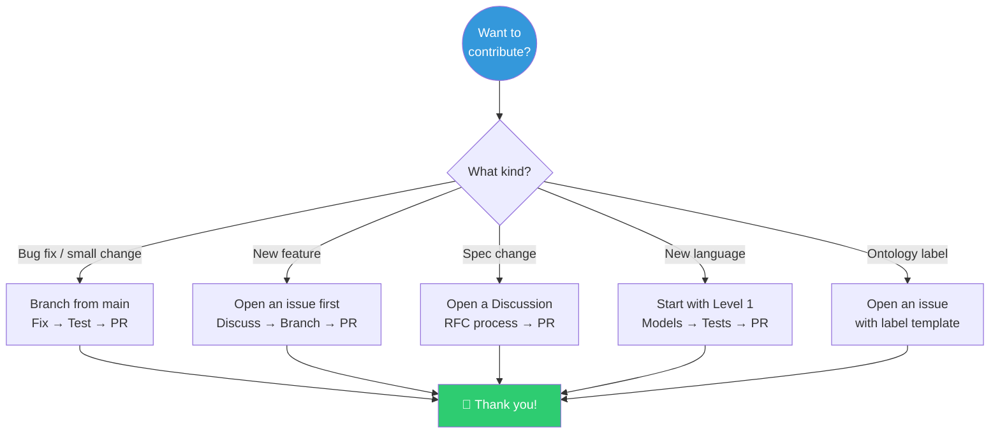

# Contributing to the Universal Personalization Protocol (UPP)

Thank you for your interest in contributing to UPP! We believe that building an
industry-standard protocol for structured context requires a vibrant, inclusive
community. Whether you're fixing a typo, proposing a new ontology label, adding
a language implementation, or challenging a design decision — you're welcome
here.

> **All contributions must be in English** — code, comments, commit messages,
> issues, and pull requests.

---

## Table of Contents

1. [Ways to Contribute](#1-ways-to-contribute)
2. [Getting Started](#2-getting-started)
   - 2.1 [Prerequisites](#21-prerequisites)
   - 2.2 [Fork & Clone](#22-fork--clone)
   - 2.3 [Repository Layout](#23-repository-layout)
3. [Development Setup](#3-development-setup)
   - 3.1 [Python Implementation](#31-python-implementation)
   - 3.2 [TypeScript Implementation](#32-typescript-implementation)
4. [Contribution Workflow](#4-contribution-workflow)
   - 4.1 [Branching Strategy](#41-branching-strategy)
   - 4.2 [Commit Convention](#42-commit-convention)
   - 4.3 [Pull Request Process](#43-pull-request-process)
   - 4.4 [Code Review](#44-code-review)
5. [Specification Changes](#5-specification-changes)
   - 5.1 [RFC Process](#51-rfc-process)
   - 5.2 [Spec Document Guidelines](#52-spec-document-guidelines)
   - 5.3 [RFC 2119 Language](#53-rfc-2119-language)
6. [Ontology Changes](#6-ontology-changes)
7. [JSON Schema Changes](#7-json-schema-changes)
8. [Adding a New Language Implementation](#8-adding-a-new-language-implementation)
   - 8.1 [Conformance Levels](#81-conformance-levels)
   - 8.2 [Implementation Checklist](#82-implementation-checklist)
   - 8.3 [Registering Your Implementation](#83-registering-your-implementation)
9. [Coding Standards](#9-coding-standards)
   - 9.1 [Python](#91-python)
   - 9.2 [TypeScript](#92-typescript)
   - 9.3 [Documentation](#93-documentation)
10. [Testing Requirements](#10-testing-requirements)
    - 10.1 [Unit Tests](#101-unit-tests)
    - 10.2 [Conformance Tests](#102-conformance-tests)
    - 10.3 [Cross-Language Round-Trip](#103-cross-language-round-trip)
11. [Issue & Discussion Guidelines](#11-issue--discussion-guidelines)
12. [Governance & Decision-Making](#12-governance--decision-making)
13. [Code of Conduct](#13-code-of-conduct)
14. [License](#14-license)
15. [Recognition](#15-recognition)

---

## 1. Ways to Contribute



| Contribution Type | Difficulty | Good First Issue? |
|---|---|---|
| Fix a typo or broken link | 🟢 Easy | ✅ Yes |
| Add a documentation example | 🟢 Easy | ✅ Yes |
| Write a missing unit test | 🟡 Medium | ✅ Yes |
| Propose a new ontology label | 🟡 Medium | Possible |
| Improve an existing implementation | 🟡 Medium | Possible |
| Add a new language implementation | 🔴 Hard | No |
| Propose a specification change (RFC) | 🔴 Hard | No |
| Add a new transport binding | 🔴 Hard | No |

---

## 2. Getting Started

### 2.1 Prerequisites

- **Git** ≥ 2.30
- **Python** ≥ 3.11 (for the Python implementation)
- **Node.js** ≥ 18.0 (for the TypeScript implementation)
- A code editor with Markdown preview support

### 2.2 Fork & Clone

```bash
# 1. Fork the repository on GitHub
# 2. Clone your fork
git clone https://github.com/<your-username>/upp.git
cd upp

# 3. Add the upstream remote
git remote add upstream https://github.com/Contextually-AI/upp.git

# 4. Verify remotes
git remote -v
# origin    https://github.com/<your-username>/upp.git (fetch)
# upstream  https://github.com/Contextually-AI/upp.git (fetch)
```

### 2.3 Repository Layout

```
upp/
├── spec/                          # Protocol specification documents
│   ├── 01-overview.md
│   ├── 02-data-models.md
│   ├── 03-operations.md
│   ├── 04-ontology.md
│   ├── 05-transport.md
│   ├── 06-privacy.md
│   ├── 07-ontology-management.md
│   └── 08-conformance.md
├── schema/                        # JSON Schema definitions (draft 2020-12)
│   ├── event.json
│   ├── stored-event.json
│   ├── label-definition.json
│   ├── ontology.json
│   ├── enums/
│   └── rpc/
├── ontologies/                    # Ontology data files
│   └── user/
│       └── v1.json
├── implementations/               # Reference implementations
│   ├── python/                    # Python (pydantic, pytest, ruff)
│   └── typescript/                # TypeScript (zod, vitest)
├── examples/                      # Usage examples
│   ├── python/
│   └── typescript/
├── CONTRIBUTING.md                # ← You are here
├── CHANGELOG.md
└── LICENSE
```

---

## 3. Development Setup

### 3.1 Python Implementation

```bash
cd implementations/python

# Create and activate a virtual environment
python -m venv .venv
source .venv/bin/activate   # Linux/macOS
# .venv\Scripts\activate    # Windows

# Install in editable mode with dev dependencies
pip install -e ".[dev]"

# Run tests
pytest

# Run tests with coverage
pytest --cov=upp --cov-report=term-missing

# Lint
ruff check src/ tests/

# Type check
mypy src/
```

### 3.2 TypeScript Implementation

```bash
cd implementations/typescript

# Install dependencies
npm install

# Build
npm run build

# Run tests
npm test

# Run tests in watch mode
npm run test:watch

# Run tests with coverage
npm run test:coverage

# Type check (without emitting)
npm run typecheck

# Lint
npm run lint
```

---

## 4. Contribution Workflow

### 4.1 Branching Strategy

```mermaid
gitgraph
    commit id: "main"
    branch feature/add-who-nickname-label
    checkout feature/add-who-nickname-label
    commit id: "add label definition"
    commit id: "add python model"
    commit id: "add typescript model"
    commit id: "add tests"
    checkout main
    merge feature/add-who-nickname-label id: "PR #42 merged"
```

| Branch Type | Naming Convention | Example |
|---|---|---|
| Feature | `feature/<short-description>` | `feature/add-websocket-transport` |
| Bug fix | `fix/<short-description>` | `fix/confidence-range-validation` |
| Spec change | `spec/<topic>` | `spec/add-batch-operations` |
| Ontology | `ontology/<description>` | `ontology/add-cultural-labels` |
| Docs | `docs/<description>` | `docs/improve-quickstart-guide` |
| Implementation | `impl/<lang>/<description>` | `impl/python/add-retrieve-scoring` |

**Always branch from `main`:**

```bash
git checkout main
git pull upstream main
git checkout -b feature/my-feature
```

### 4.2 Commit Convention

We follow [Conventional Commits](https://www.conventionalcommits.org/) v1.0.0:

```
<type>(<scope>): <short description>

[optional body]

[optional footer(s)]
```

**Types:**

| Type | When to Use |
|---|---|
| `feat` | A new feature or capability |
| `fix` | A bug fix |
| `docs` | Documentation-only changes |
| `spec` | Specification document changes |
| `schema` | JSON Schema changes |
| `ontology` | Ontology definition changes |
| `test` | Adding or correcting tests |
| `refactor` | Code refactoring (no feature/fix) |
| `chore` | Build, CI, or tooling changes |
| `style` | Formatting, whitespace, etc. |

**Scopes:**

| Scope | Meaning |
|---|---|
| `python` | Python reference implementation |
| `typescript` | TypeScript reference implementation |
| `spec` | Specification documents |
| `schema` | JSON Schema definitions |
| `ontology` | Ontology definitions |
| `conformance` | Conformance test suite |
| `ci` | Continuous integration |

**Examples:**

```
feat(python): add keyword-based retriever implementation

fix(typescript): correct confidence clamping in Event constructor

spec(operations): clarify upp/ingest supersession behavior

ontology: add who_nickname label to identity category

schema: fix required fields in ingest-response.json

test(conformance): add event supersession chain test

docs: add quickstart guide for data portability
```

### 4.3 Pull Request Process



**Before opening a PR:**

1. ✅ Rebase onto the latest `main`.
2. ✅ All existing tests pass.
3. ✅ New code has tests.
4. ✅ Linting passes (ruff for Python, eslint for TypeScript).
5. ✅ Type checking passes (mypy for Python, tsc for TypeScript).
6. ✅ Documentation is updated if behavior changes.
7. ✅ CHANGELOG.md is updated under `## [Unreleased]`.

**PR template:**

```markdown
## Summary

Brief description of what this PR does.

## Motivation

Why is this change needed? Link to issue if applicable.

## Changes

- Bullet list of key changes

## Conformance Impact

- [ ] This PR changes the specification
- [ ] This PR changes JSON Schemas
- [ ] This PR changes the ontology
- [ ] This PR adds/modifies conformance requirements
- [ ] No conformance impact

## Testing

Describe how to test the changes, or link to new test cases.

## Checklist

- [ ] Tests pass
- [ ] Linting passes
- [ ] Type checking passes
- [ ] CHANGELOG.md updated
- [ ] Documentation updated (if applicable)
```

### 4.4 Code Review

All contributions require at least **one** approving review before merge.

**Specification changes** require:
- At least **two** approving reviews
- A **7-day comment period** after the last significant change
- No unresolved objections

**Reviewers should check:**

- [ ] Correctness — Does the code do what it claims?
- [ ] Spec compliance — Does it follow the protocol specification?
- [ ] Test coverage — Are edge cases covered?
- [ ] Documentation — Are public APIs documented?
- [ ] Backwards compatibility — Does it break existing behavior?
- [ ] Cross-language consistency — Would this work the same in Python and TypeScript?

---

## 5. Specification Changes

Changes to the protocol specification (`spec/*.md`) have the highest bar
because they affect every implementation. We follow a lightweight RFC
process inspired by the IETF and Rust RFC processes.

### 5.1 RFC Process



**Steps:**

1. **Open a Discussion** — Use the GitHub Discussions tab (or an issue
   labeled `rfc`) to propose your idea. Include:
   - **Problem statement** — What gap does this fill?
   - **Proposed solution** — What would the spec say?
   - **Alternatives considered** — What else did you evaluate?
   - **Impact assessment** — Which implementations need changes?

2. **Iterate** — Refine based on community feedback.

3. **Draft a PR** — Once there's rough consensus, open a PR with the
   actual spec changes. Reference the discussion.

4. **Comment period** — After the PR is opened, a mandatory 7-day
   comment period begins. Changes during this period reset the clock.

5. **Merge** — With ≥ 2 maintainer approvals and no unresolved
   objections, the PR is merged.

### 5.2 Spec Document Guidelines

- Use [RFC 2119](https://www.rfc-editor.org/rfc/rfc2119) key words
  (MUST, SHOULD, MAY) precisely and deliberately.
- Include Mermaid diagrams for complex flows.
- Provide concrete JSON examples for every new structure.
- Reference other spec sections by number (e.g., "see §5.3").
- Maintain the existing table of contents structure.
- All spec documents use the `> **Version** | **Status**` header pattern.

### 5.3 RFC 2119 Language

When writing spec text, use key words exactly as defined:

| Word | Meaning |
|---|---|
| **MUST** | Absolute requirement — non-negotiable |
| **MUST NOT** | Absolute prohibition |
| **SHOULD** | Strong recommendation — exceptions need justification |
| **SHOULD NOT** | Strong discouragement |
| **MAY** | Truly optional — implementations choose freely |

**Do:**
```
The server MUST return an error if entity_key is missing from a upp/ingest request.
```

**Don't:**
```
The server should probably return an error if entity_key is missing.
```

---

## 6. Ontology Changes

The UPP ontology defines the label taxonomy (see
[spec/04-ontology.md](spec/04-ontology.md)). Ontology changes affect the
JSON schemas, both implementations, the conformance tests, and the spec.

**To propose a new label:**

1. Open an issue with the `ontology` label.
2. Include:
   - **Label name** (format: `<category>_<descriptor>`, e.g., `who_nickname`)
   - **Category** (WHO, WHAT, WHERE, WHEN, WHY, HOW, REL, PREF, META)
   - **Display name** (e.g., "Nickname")
   - **Description** (human-readable)
   - **Cardinality** (`singular` or `plural`)
   - **Durability** (`permanent`, `transient`, or `ephemeral`)
   - **Sensitivity tier** (`tier_public`, `tier_work`, `tier_personal`,
     `tier_sensitive`, `tier_internal`)
   - **Justification** — Why does this label add value?
   - **Example values** — Realistic example data

3. If approved, submit a PR that updates **all of the following**:
   - `ontologies/user/v1.json` (or the relevant ontology file)
   - `spec/04-ontology.md` (label tables and counts)
   - `schema/label-definition.json` (if schema constraints change)
   - Python implementation — model enums/constants
   - TypeScript implementation — model enums/constants
   - Relevant tests in both implementations

**Label naming rules:**

- Prefix with the 5W+H category: `who_`, `what_`, `where_`, `when_`,
  `why_`, `how_`, `rel_`, `pref_`, `meta_`
- Use `snake_case` for the descriptor portion
- Keep it concise but unambiguous
- Use English words only

---

## 7. JSON Schema Changes

All JSON schemas in `schema/` use [JSON Schema draft 2020-12](https://json-schema.org/draft/2020-12/json-schema-core).

**Rules for schema changes:**

1. Every schema change **MUST** have a corresponding spec change (or
   be derived from one).
2. Schemas **MUST** validate against the meta-schema.
3. New required fields are a **breaking change** — they require an RFC.
4. New optional fields are a non-breaking change.
5. All schemas **MUST** include a `"$id"` and `"$schema"` field.
6. Schemas **MUST** include `"description"` for every property.

**Testing schema changes:**

```bash
# Validate a schema against the meta-schema (example using ajv-cli)
ajv validate -s https://json-schema.org/draft/2020-12/schema -d schema/event.json
```

---

## 8. Adding a New Language Implementation

We actively welcome implementations in new languages! UPP is
language-agnostic by design, and every new implementation strengthens
the protocol's interoperability story.

### 8.1 Conformance Levels

Every implementation targets one of three conformance levels (see
[spec/08-conformance.md](spec/08-conformance.md)):



| Level | Name | What It Covers | Good Starting Point? |
|---|---|---|---|
| **1** | Minimal | Data models + `upp/ingest`, `upp/retrieve`, `upp/info` | ✅ Start here |
| **2** | Full | Level 1 + `upp/events`, `upp/delete`, `upp/labels` | After Level 1 is solid |
| **3** | Portable | Level 2 + `upp/export`, `upp/import` | Mature implementations |

### 8.2 Implementation Checklist

Use this checklist when building a new implementation:

**Directory structure:**

```
implementations/<language>/
├── README.md              # Setup, usage, conformance level
├── src/                   # Source code
│   └── <package>/
│       ├── models/        # UPP data types
│       ├── rpc/           # JSON-RPC operations
│       └── backends/      # Storage/retrieval backends
├── tests/                 # Tests
└── <build-config>         # pyproject.toml, package.json, Cargo.toml, etc.
```

**Level 1 (Minimal) checklist:**

- [ ] Core types implemented: `Event`, `StoredEvent`, `LabelDefinition`
- [ ] All enumerations: `EventStatus` (`valid`, `staged`, `superseded`),
      `SourceType` (`user_stated`, `agent_observed`, `inferred`),
      `SensitivityTier`, `Cardinality` (`singular`, `plural`),
      `Durability` (`permanent`, `transient`, `ephemeral`)
- [ ] JSON serialization produces schema-valid output
- [ ] JSON deserialization handles all required and optional fields
- [ ] Unknown fields are tolerated (not rejected)
- [ ] Round-trip fidelity: serialize → deserialize → serialize is lossless
- [ ] Default values applied correctly
- [ ] Validation errors are clear and actionable
- [ ] `upp/ingest` — accept text, return `StoredEvent[]`
- [ ] `upp/retrieve` — accept query, return `Event[]`
- [ ] `upp/info` — return protocol version, ontologies, operations
- [ ] JSON-RPC 2.0 request/response handling
- [ ] Error codes per spec (-32600 through -32004)
- [ ] Comprehensive test suite (aim for > 90% coverage)
- [ ] README.md with setup instructions and usage examples
- [ ] Type-safe — use the language's type system effectively
- [ ] Documented — public API has doc comments

**Level 2 (Full) additions:**

- [ ] `upp/events` — list raw events for a user
- [ ] `upp/delete` — delete events by ID or all for a user
- [ ] `upp/labels` — return label definitions from an ontology
- [ ] Event supersession logic (singular cardinality labels)
- [ ] At least one transport binding (stdio, HTTP+SSE, or WebSocket)
- [ ] Integration tests

**Level 3 (Portable) additions:**

- [ ] `upp/export` — export all events for a user in portable format
- [ ] `upp/import` — import events from another UPP server
- [ ] Full event lifecycle (staged → valid → superseded)
- [ ] Cross-vendor interoperability tests

### 8.3 Registering Your Implementation

Once your implementation passes the conformance test suite, you can
register it:

1. Run the conformance test suite and capture the output.
2. Add your implementation to `implementations/REGISTRY.md`.
3. Open a PR — the community will review your conformance results.

---

## 9. Coding Standards

### 9.1 Python

| Rule | Tool | Config |
|---|---|---|
| Formatting & linting | [Ruff](https://docs.astral.sh/ruff/) | `pyproject.toml` |
| Type checking | [mypy](https://mypy-lang.org/) (strict) | `pyproject.toml` |
| Models | [Pydantic](https://docs.pydantic.dev/) v2+ | — |
| Tests | [pytest](https://docs.pytest.org/) | `pyproject.toml` |
| Python version | ≥ 3.11 | — |
| Line length | 99 characters | `pyproject.toml` |

**Style guidelines:**

- Use `frozen=True` on Pydantic models for immutability.
- Use `Annotated` types with `Field()` for validation.
- Prefer explicit imports over wildcard imports.
- Use `Enum(str, Enum)` pattern for string enumerations.
- Write docstrings in Google style.

**Example:**

```python
class Event(BaseModel, frozen=True):
    """A single personal fact extracted from a conversation.

    Attributes:
        value: The extracted fact as a human-readable string.
        labels: One or more ontology labels for classification.
        confidence: Extraction confidence score in [0.0, 1.0].
        source_type: How the fact was obtained.
    """

    value: str
    labels: Annotated[list[str], Field(min_length=1)]
    confidence: Annotated[float, Field(ge=0.0, le=1.0)] = 1.0
    source_type: SourceType | None = None
```

### 9.2 TypeScript

| Rule | Tool | Config |
|---|---|---|
| Type checking | [TypeScript](https://www.typescriptlang.org/) (strict) | `tsconfig.json` |
| Validation | [Zod](https://zod.dev/) | — |
| Tests | [Vitest](https://vitest.dev/) | `vitest.config.ts` |
| Node version | ≥ 18.0 | `package.json` engines |
| Module system | ESM (`"type": "module"`) | `package.json` |

**Style guidelines:**

- Use `readonly` properties on interfaces for immutability.
- Use Zod schemas as the source of truth; derive TypeScript types with `z.infer<>`.
- Export both the Zod schema and the inferred type.
- Use `as const` assertions for enum-like values.
- Prefer explicit return types on exported functions.

**Example:**

```typescript
export const EventSchema = z.object({
  value: z.string().min(1),
  labels: z.array(z.string()).min(1),
  confidence: z.number().min(0).max(1).default(1.0),
  source_type: SourceTypeSchema.optional(),
});

export type Event = z.infer<typeof EventSchema>;
```

### 9.3 Documentation

- All public APIs **MUST** have doc comments.
- All spec files **MUST** have a table of contents.
- Diagrams use [Mermaid](https://mermaid.js.org/) syntax (renders natively on GitHub).
- Prefer inline code examples over separate files.
- Keep line length ≤ 80 characters in Markdown for readability.
- Use `<!-- prettier-ignore -->` where needed to preserve formatting.

---

## 10. Testing Requirements

### 10.1 Unit Tests

Every implementation **MUST** have comprehensive unit tests.

**Minimum expectations:**

- All types serialize/deserialize correctly.
- All default values are applied.
- All validation constraints are enforced (range, required, format).
- All enum values round-trip correctly.
- Edge cases: empty optionals, Unicode values, maximum precision floats.
- Supersession logic for singular cardinality labels.
- Event lifecycle transitions (valid, staged, superseded).

**Coverage targets:**

| Component | Target |
|---|---|
| Data models | ≥ 95% |
| Enumerations | 100% |
| Operations | ≥ 90% |
| Transport | ≥ 85% |

### 10.2 Conformance Tests

Implementations **SHOULD** pass all conformance tests for their target
level before claiming that level. See
[spec/08-conformance.md](spec/08-conformance.md) for the full test
matrix.

### 10.3 Cross-Language Round-Trip

For changes that touch data serialization, verify that the JSON produced
by one implementation can be consumed by others:

1. Serialize in Python → validate against JSON Schema → deserialize in TypeScript.
2. Serialize in TypeScript → validate against JSON Schema → deserialize in Python.
3. Verify no data loss.

---

## 11. Issue & Discussion Guidelines

**Bug reports** should include:

- UPP version (spec version and implementation version)
- Steps to reproduce
- Expected behavior
- Actual behavior
- Environment (OS, language version, runtime)

**Feature requests** should include:

- Problem statement
- Proposed solution
- Impact assessment (which parts of the protocol are affected?)
- Alternatives considered

**Labels we use:**

| Label | Meaning |
|---|---|
| `bug` | Something isn't working |
| `enhancement` | New feature or improvement |
| `rfc` | Specification change proposal |
| `ontology` | Ontology label change |
| `good-first-issue` | Good for newcomers |
| `help-wanted` | Extra attention needed |
| `breaking` | Breaking change |
| `python` | Python implementation |
| `typescript` | TypeScript implementation |
| `schema` | JSON Schema related |

---

## 12. Governance & Decision-Making

UPP is in its **early stage** (v0.x). During this phase:

- **Maintainers** have final say on merges, but strive for consensus.
- **Specification changes** require the RFC process (§5.1).
- **Implementation changes** require standard review (≥ 1 approval).
- **Breaking changes** require broader discussion and a deprecation plan.

As the project grows, we intend to formalize governance with:

- A **Technical Steering Committee (TSC)** for spec decisions.
- A **voting process** for contentious RFCs.
- An **advisory board** representing major implementations.

---

## 13. Code of Conduct

We are committed to providing a welcoming and inclusive experience for
everyone. All participants in UPP are expected to:

- **Be respectful** — Disagree constructively. Critique code, not people.
- **Be inclusive** — Welcome newcomers. Use accessible language.
- **Be collaborative** — Share knowledge. Help others succeed.
- **Be honest** — Acknowledge mistakes. Give credit where due.

Unacceptable behavior includes harassment, personal attacks, trolling,
and publishing others' private information.

If you experience or witness unacceptable behavior, please report it to
the maintainers. All reports will be reviewed and investigated promptly.

---

## 14. License

By contributing to UPP, you agree that your contributions will be
licensed under the [MIT License](LICENSE).

All contributions are subject to the project's license terms. You
represent that you have the right to submit the contribution and that
it does not infringe on any third-party rights.

---

## 15. Recognition

We believe in recognizing contributions! Contributors are acknowledged in:

- The `CHANGELOG.md` for each release.
- The GitHub contributors graph.
- Future: a dedicated `CONTRIBUTORS.md` with role-based recognition.

**Types of recognized contributions:**

- 💻 Code contributions
- 📖 Documentation improvements
- 🐛 Bug reports
- 💡 Ideas and proposals
- 👀 Code review
- 🧪 Testing
- 🌍 New language implementations

---

## Quick Reference



**Need help?** Open an issue, start a discussion, or reach out to the
maintainers. We're here to help you succeed!
