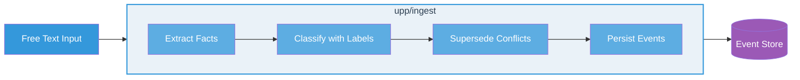
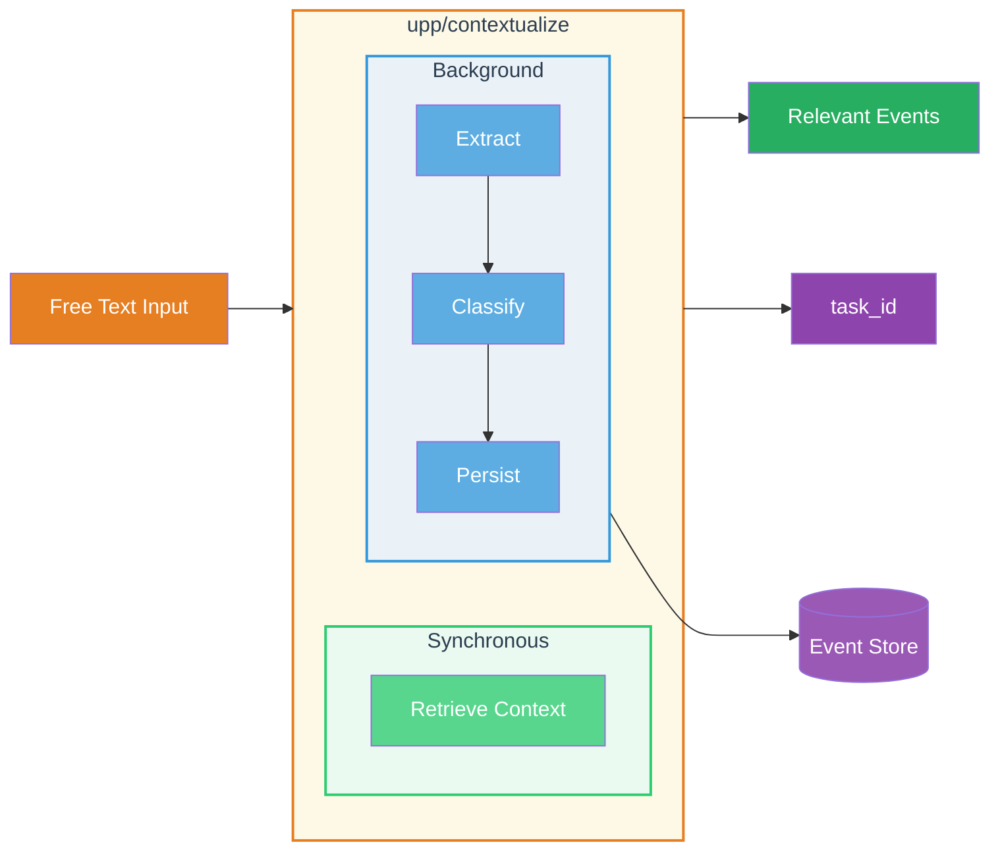
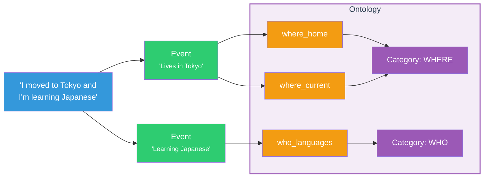
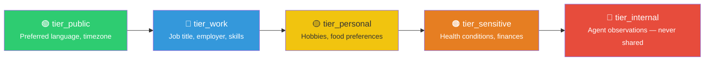

<p align="center">
  <h1 align="center"> UPP — Universal Personalization Protocol</h1>
  <p align="center">
    <strong>An open protocol for AI systems to manage structured context.</strong>
  </p>
  <p align="center">
    <a href="https://pypi.org/project/upp-python/"></a>
    <a href="LICENSE"></a>
    
    
    
    <a href="https://discord.gg/FJnjytqP"></a>
  </p>
  <p align="center">
    Created by <a href="https://contextually.me/"><strong>Contextually</strong></a> — building the future of personalized AI.
  </p>
</p>

---

> **UPP defines _interfaces_, not implementations.** Any language, any database, any LLM — if it speaks UPP, it interoperates.

---

## Why UPP?

AI systems are stateless by default. Every session starts from zero — users repeat context, preferences get lost, and personalization is rebuilt from scratch. When memory does exist, it's locked inside proprietary systems with no path to portability.

**UPP changes this.** It defines a standard protocol — 10 operations, structured ontologies, and a portable event format — that any platform can implement. When multiple systems speak UPP, users carry their context between them. When a vendor adopts UPP, their product becomes part of an interoperable ecosystem instead of a silo.

The protocol is intentionally minimal: it standardizes **what** operations exist and **how** data is structured, while leaving implementation details to each vendor. This makes adoption lightweight — implement the interface, keep your architecture.

### Protocol vs. Recommendations

UPP has two distinct layers:

- **The protocol (mandatory for interoperability):** The JSON-RPC operations (`upp/ingest`, `upp/retrieve`, `upp/contextualize`, etc.) and the core data models (Event, StoredEvent, LabelDefinition). This is the contract. As long as your system implements these interfaces, it is UPP-compatible — regardless of what happens under the hood. You can use RAG pipelines, full-context windows, vector databases, SQL stores, graph databases, or any other architecture.

- **The recommendations (optional best practices):** Everything else — the built-in ontology with 57 labels, event supersession logic, sensitivity tiers, cardinality rules — represents how UPP suggests handling structured context. These are patterns that work well in practice, but they are not required for compatibility. You can adopt them incrementally or replace them with your own approach.

The goal is that **any memory system can speak UPP**, not just systems built a specific way. A minimal RAG-based implementation and a sophisticated event-sourced system can interoperate as long as both respect the protocol interface.

[Contextually](https://contextually.me/) — the team behind UPP — builds its own memory infrastructure following these recommendations, but the protocol itself is designed to be vendor-neutral and architecture-agnostic.

---

## Key Features

| Feature | Description |
|---|---|
| 📜 **Event-Sourced** | Every fact is an immutable event with full audit trail — supersession, not mutation |
| 🏷️ **Ontology-Driven** | Labels from structured, versioned ontologies classify every event — extensible and open |
| 🔄 **Real Portability** | Export and import events between any UPP-compatible system — users own their data |
| 🔒 **Privacy by Design** | Five sensitivity tiers built into the type system, not bolted on as an afterthought |
| 📡 **Transport Agnostic** | Works over stdio, HTTP+SSE, and WebSocket — same JSON-RPC 2.0 wire format |
| 🧩 **Modular Conformance** | Three conformance levels let implementations start minimal and grow |

---

## How It Works

UPP has three primary operations: **ingest** structured facts from text, **retrieve** relevant context for queries, and **contextualize** which combines both in a single optimized call. Everything else in the protocol builds on these primitives.

### `upp/ingest` — Extract and ingest structured facts

A single call to `upp/ingest` takes free text and turns it into classified, immutable events:



1. Receives free text — a user message, a conversation transcript, a document.
2. **Extracts** relevant facts — each becomes an immutable Event with a confidence score.
3. **Classifies** each event by assigning ontology labels (e.g., `where_home`, `who_languages`).
4. **Supersedes** conflicting events — if a new fact contradicts an existing one on a singular label, the old event is automatically marked as superseded.
5. **Persists** events in the Event Store with full audit trail.

### `upp/retrieve` — Enrich queries with personalized context

A single call to `upp/retrieve` finds the most relevant stored facts for a given query:


1. Receives a free-text query (e.g., "what does the user like to eat?").
2. **Matches** which ontology labels are relevant to the query.
3. **Searches** the Event Store for events with those labels.
4. **Ranks and filters** results by relevance and confidence, returning structured events the application can inject as context.

### `upp/contextualize` — The end-to-end workflow

In practice, AI agents almost always need both operations together: retrieve what you already know about the user, and learn new facts from the current interaction. `upp/contextualize` combines both in a single optimized call:



1. Receives the same text as both query and input.
2. **Retrieves** relevant existing events synchronously — the caller gets context immediately.
3. **Ingests** new events in the background — extraction, classification, and supersession happen asynchronously.
4. Returns a `task_id` that can be checked with `upp/get_tasks` to monitor the background ingest.

This is the recommended entry point for most AI agent integrations. One call, one round-trip, full personalization.

---

## Core Concepts



- **Events** — The atomic unit of information. A single extracted fact (e.g., "Lives in Tokyo"). Events are immutable — they are never modified, only superseded.
- **Labels** — Classification tags from the ontology, attached to each event. An event can have one or more labels. Labels carry metadata: sensitivity, cardinality, and durability.
- **Categories** — High-level groupings that organize labels by nature (e.g., WHO, WHAT, WHERE). Each ontology defines its own categories.
- **Ontologies** — Versioned collections of labels representing a specific domain. Examples: `user/v1` (user context), `agent/v1` (AI agent capabilities), `enterprise/v1` (organizational context). The system is extensible to any domain. A server instance operates with exactly one ontology.

For detailed data models (Event, StoredEvent, LabelDefinition, ExportPackage, enumerations), see [spec/02-data-models.md](spec/02-data-models.md).

---

## Installation

```bash
pip install upp-python
```

> Requires Python 3.11+. The package uses [Pydantic v2](https://docs.pydantic.dev/) for data validation.

---

## Getting Started

```python
from upp import UPPClient, Event, EventStatus, SourceType, OntologyUserV1

# Create a client with your backends (store, retriever, ontology)
client = UPPClient(store=my_store, retriever=my_retriever, ontology=OntologyUserV1())

# Ingest free text → structured events
result = await client.ingest(user_id="user-1", text="I live in Tokyo and love sushi")

# Retrieve relevant context
events = await client.retrieve(user_id="user-1", query="What food does this person like?")
```

See [`examples/python/01_quickstart.py`](examples/python/01_quickstart.py) for a complete working example with in-memory backends.

### Reference implementations and examples

| Resource | Path |
|---|---|
| Python SDK (PyPI) | [`pip install upp-python`](https://pypi.org/project/upp-python/) |
| Python implementation | [`implementations/python/`](implementations/python/) |
| TypeScript implementation | [`implementations/typescript/`](implementations/typescript/) |
| Python examples | [`examples/python/`](examples/python/) |
| TypeScript examples | [`examples/typescript/`](examples/typescript/) |
| Full examples guide | [`examples/README.md`](examples/README.md) |

---

## Operations & Conformance

UPP defines 10 operations organized into three categories. Not every server needs to implement all of them — three conformance levels let implementations start minimal and grow:

| Operation | Category | Description | Level 1 | Level 2 | Level 3 |
|---|---|---|:---:|:---:|:---:|
| `upp/ingest` | Core | Extract and ingest events from text | ✅ | ✅ | ✅ |
| `upp/retrieve` | Core | Intelligent search for relevant events | ✅ | ✅ | ✅ |
| `upp/info` | Discovery | Server metadata and capabilities | ✅ | ✅ | ✅ |
| `upp/contextualize` | Core | Retrieve context and ingest in the background | | ✅ | ✅ |
| `upp/get_tasks` | Discovery | Check status of background tasks | | ✅ | ✅ |
| `upp/get_events` | Core | Raw listing of stored events | | ✅ | ✅ |
| `upp/delete_events` | Core | Delete events (GDPR/CCPA compliance) | | ✅ | ✅ |
| `upp/get_labels` | Discovery | Available labels in an ontology | | ✅ | ✅ |
| `upp/export_events` | Portability | Export events for migration | | | ✅ |
| `upp/import_events` | Portability | Import events from another server | | | ✅ |

> 🟢 **Level 1 — Minimal** (3 ops): The building blocks. Suitable for early adoption.
> 🔵 **Level 2 — Full** (8 ops): Production-ready with optimized flows, compliance, and monitoring.
> 🟣 **Level 3 — Portable** (10 ops): Full interoperability and data portability between vendors.

---

## Ontologies

An **ontology** in UPP is a versioned collection of label definitions that determine what kinds of facts can be captured for a given domain. Ontologies are a general, extensible concept — they can be created for any domain that needs structured context classification.

The protocol supports multiple ontology types:

| Type | Description |
|---|---|
| `user` | Context about users — identity, skills, preferences, behavior |
| `enterprise` | Context about companies and organizations |
| `agent` | Context about AI agents and their capabilities |
| `location` | Contextual information about places |
| *custom* | Any domain — `medical`, `financial`, `gaming`, etc. |

### The `user/v1` Ontology

UPP ships with a **user ontology** as its first built-in definition: 57 labels across 6 categories, inspired by the journalistic 5W+H framework:

| Category | Question | Example Labels |
|---|---|---|
| **WHO** (19) | Who is this person? | `who_name`, `who_age`, `who_languages`, `who_role` |
| **WHAT** (9) | What are they doing / interested in? | `what_skills`, `what_interests_hobbies`, `what_active_projects` |
| **WHERE** (6) | Where are they? | `where_home`, `where_work`, `where_current_location` |
| **WHEN** (8) | When do things happen? | `when_routines`, `when_life_events`, `when_work_schedule` |
| **WHY** (6) | Why do they do things? | `why_goals`, `why_values_motivations`, `why_priorities` |
| **HOW** (9) | How do they prefer things done? | `how_communication`, `how_workflow`, `how_learning` |

The label schema also supports `PREF`, `REL`, and `META` categories for use in custom ontologies.

Ontologies are **extensible** — create labels for your domain while staying compatible with the standard structure. See [spec/04-ontology.md](spec/04-ontology.md) for the full ontology specification and [spec/07-ontology-management.md](spec/07-ontology-management.md) for versioning and management.

---

## Privacy & Sensitivity

Sensitivity is a **first-class protocol concept**, not an afterthought. Every label carries a sensitivity tier:



Implementations use these tiers to enforce consent-based access control. See [spec/06-privacy.md](spec/06-privacy.md) for the full privacy and consent model.

---

## MCP Compatibility

UPP shares the [JSON-RPC 2.0](https://www.jsonrpc.org/specification) wire format with the [Model Context Protocol (MCP)](https://modelcontextprotocol.io/) and is designed to coexist. Where MCP handles tool and resource access, UPP handles structured context and identity. A UPP server can be exposed as MCP tools (`ingest`, `retrieve`, `contextualize`, etc.) for seamless integration.

---

## Repository Structure

```
upp/
├── spec/              # 📄 Protocol specification (8 documents)
├── schema/            # 📐 JSON Schema definitions (draft 2020-12)
├── ontologies/        # 🏷️ Ontology data files (user/v1 included)
├── implementations/   # 🔧 Reference implementations (Python + TypeScript)
├── examples/          # 💡 8 progressive examples per language
└── README.md          # ← You are here
```

---

## Specification Documents

| # | Document | Scope |
|---|---|---|
| 01 | [Overview](spec/01-overview.md) | Architecture, philosophy, terminology |
| 02 | [Data Models](spec/02-data-models.md) | Event, StoredEvent, LabelDefinition, all enums |
| 03 | [Operations](spec/03-operations.md) | 10 JSON-RPC methods with schemas |
| 04 | [Ontology](spec/04-ontology.md) | Ontology structure, label taxonomy, extensibility |
| 05 | [Transport](spec/05-transport.md) | Wire format, transport bindings |
| 06 | [Privacy & Consent](spec/06-privacy.md) | Sensitivity tiers, consent model, GDPR compliance |
| 07 | [Ontology Management](spec/07-ontology-management.md) | Ontology versioning, creation, management |
| 08 | [Conformance](spec/08-conformance.md) | Conformance levels, testing approach |

---

## Community & Resources

- 💬 **[Join the Discord](https://discord.gg/FJnjytqP)** — discuss the protocol, propose ideas, and connect with other implementers.
- 📊 **[CRI Benchmark](https://github.com/Contextually-AI/cri-benchmark)** — the Contextual Resonance Index, an open-source standard for evaluating AI long-term memory systems.
- 🌐 **[Contextually](https://contextually.me/)** — the team behind UPP. We're building the infrastructure for context-aware AI — our mission is to make AI that truly understands.

---

## Contributing

All contributions are welcome — from typo fixes to new language implementations. See [CONTRIBUTING.md](CONTRIBUTING.md) for the full guide, including branching strategy, RFC process for spec changes, and ontology label proposals.

---

## At a Glance

| Aspect | Detail |
|---|---|
| **Wire format** | JSON-RPC 2.0 |
| **Method namespace** | `upp/` (e.g., `upp/ingest`, `upp/retrieve`) |
| **Operations** | 10 (5 core + 3 discovery + 2 portability) |
| **Core entities** | 3 (Event, StoredEvent, LabelDefinition) |
| **Backend interfaces** | 3 (Store, Retriever, Ontology) |
| **Default ontology** | 57 labels across 6 categories (`user/v1`) |
| **Sensitivity tiers** | 5 (public → internal) |
| **Conformance levels** | 3 (Minimal, Full, Portable) |
| **Schema format** | JSON Schema draft 2020-12 |
| **Python SDK** | [`pip install upp-python`](https://pypi.org/project/upp-python/) |
| **Reference implementations** | Python 3.11+ (Pydantic v2), TypeScript 5.x (strict) |
| **License** | MIT |

---

## Design Influences

[Model Context Protocol](https://modelcontextprotocol.io/) (wire format) · [JSON-RPC 2.0](https://www.jsonrpc.org/specification) · [JSON Schema](https://json-schema.org/) · Event Sourcing / DDD · 5W+H Journalism Framework (`user/v1` ontology)

## Benchmarking

Evaluating memory systems is hard. The **[CRI Benchmark (Contextual Resonance Index)](https://github.com/Contextually-AI/cri-benchmark)** is the open-source standard for evaluating AI long-term memory systems. It measures how well ontology-based memory systems perform across extraction, classification, retrieval, and supersession — the core operations UPP defines.

---

## License

[MIT License](LICENSE)

---

<p align="center">
  <a href="https://contextually.me/">
    
  </a>
  <br/><br/>
  <strong>UPP is an open standard by <a href="https://contextually.me/">Contextually</a>. Build with it. Extend it. Make AI remember.</strong>
  <br/>
  <a href="https://discord.gg/FJnjytqP">Discord</a> · <a href="https://github.com/Contextually-AI/cri-benchmark">CRI Benchmark</a> · <a href="https://contextually.me/">contextually.me</a>
</p>
