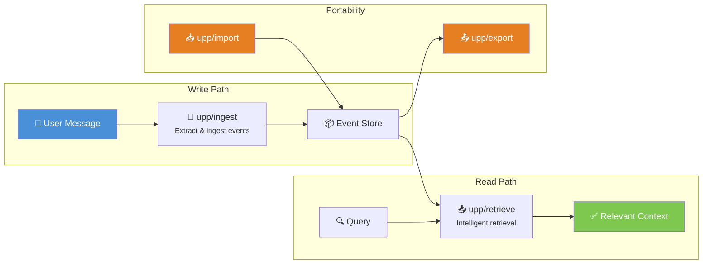
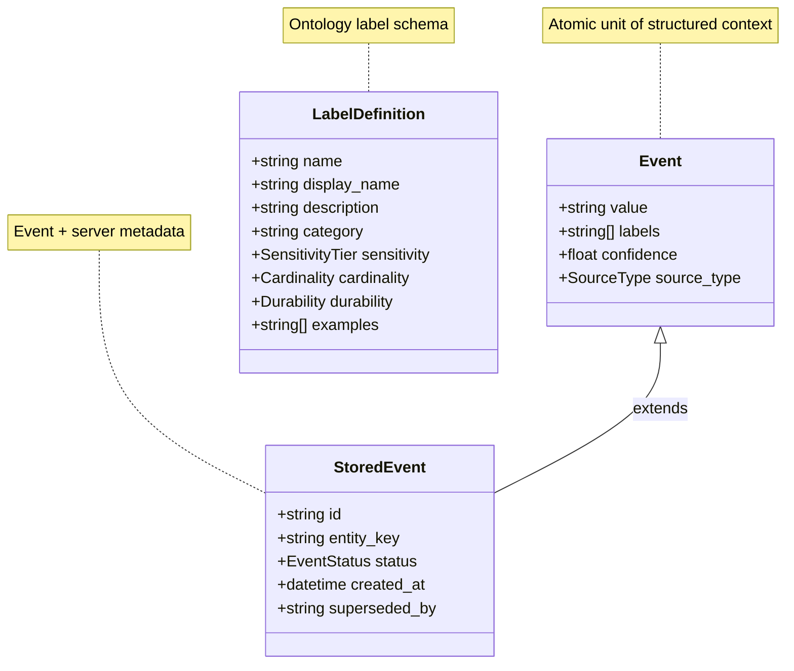

# UPP Examples

Comprehensive, runnable examples demonstrating the **Universal Personalization Protocol (UPP)** — an open protocol for AI systems to manage structured context.

These examples cover every major feature of the protocol, from basic event creation to data portability between UPP-compatible vendors.

## How UPP Works



## Examples Overview

| # | Example | Description |
|---|---------|-------------|
| 01 | **Quickstart** | Minimal working example — create events, store them, retrieve them |
| 02 | **Event Lifecycle** | Event statuses (`valid`, `staged`, `superseded`), cardinality-based supersession |
| 03 | **Custom Backends** | Implement your own store and retriever backends |
| 04 | **Compliance & Deletion** | GDPR/CCPA event deletion with `upp/delete` |
| 05 | **Privacy & Sensitivity** | Sensitivity tiers, privacy-aware filtering, consent controls |
| 06 | **RPC Client/Server** | JSON-RPC 2.0 communication layer for inter-process UPP operations |
| 07 | **Ontology Management** | Create, validate, and extend ontologies with custom label definitions |
| 08 | **Portability** | Export/import events for migration between UPP-compatible vendors |

## Prerequisites

- **Python examples**: Python 3.11+ with `upp-python` package installed
- **TypeScript examples**: Node.js 18+ with `@upp/sdk` package installed

See the language-specific READMEs for detailed setup instructions:

- [Python Examples](python/README.md)
- [TypeScript Examples](typescript/README.md)

## Quick Start

### Python

```bash
cd examples/python
pip install -e ../../implementations/python
python 01_quickstart.py
```

### TypeScript

```bash
cd examples/typescript
npm install
npx tsx 01-quickstart.ts
```

## Data Model



## Conformance Levels

The examples cover all three conformance levels:

| Level | Name | Operations | Examples |
|---|---|---|---|
| **1** | Minimal | `ingest`, `retrieve`, `info` | 01, 02, 03 |
| **2** | Full | + `events`, `delete`, `labels` | 04, 05, 06, 07 |
| **3** | Portable | + `export`, `import` | 08 |

## License

These examples are part of the UPP specification repository and are
released under the same [MIT License](../LICENSE) as the main project.
